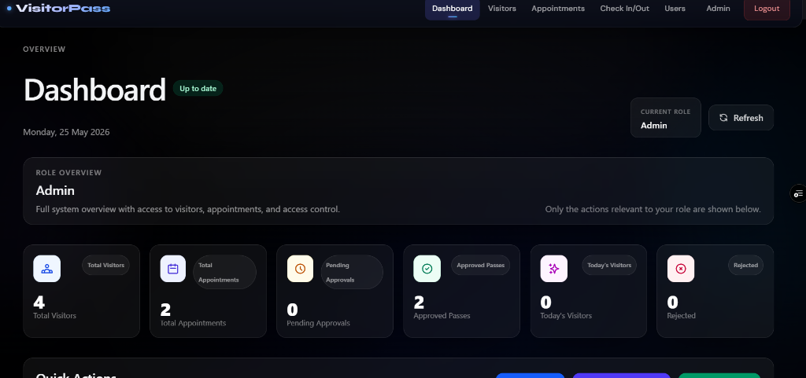
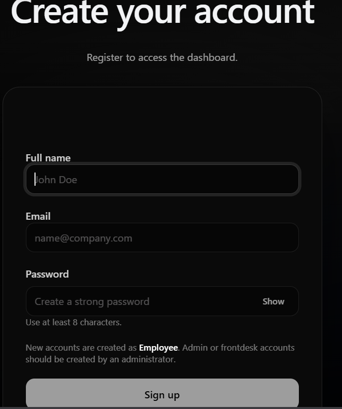
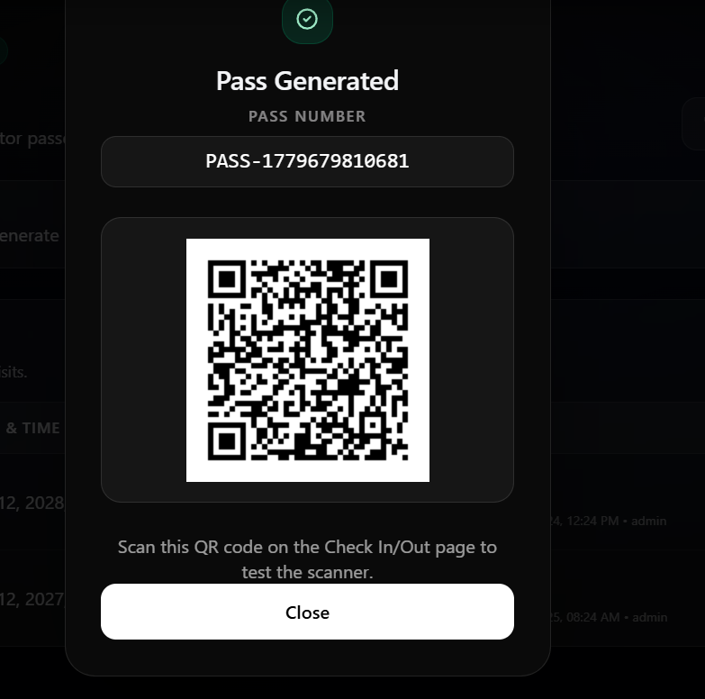
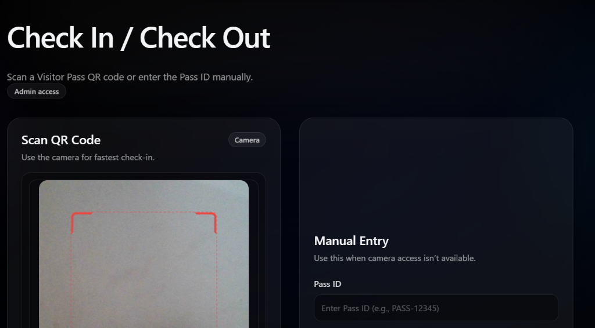

# 🏢 VisitorPass — Enterprise Visitor Management System

A modern **MERN-stack** visitor management application for offices/campuses that helps front desks **pre-register visitors**, **check them in securely**, and **generate digital/PDF entry passes**.

> **Live site:** https://auth-project-main.vercel.app

<div align="center">

  
  
  
  
  

</div>

---

## 📌 Table of Contents

- [About](#-about)
- [Why this project](#-why-this-project)
- [Key Features](#-key-features)
- [Tech Stack](#-tech-stack)
- [How it works (high level flow)](#-how-it-works-high-level-flow)
- [Roles & Permissions](#-roles--permissions)
- [Project Structure](#-project-structure)
- [Getting Started (Local Setup)](#-getting-started-local-setup)
  - [Prerequisites](#prerequisites)
  - [Clone](#1-clone-the-repository)
  - [Environment Variables](#2-environment-variables)
  - [Install & Run](#3-install--run)
  - [Seed Demo Data](#4-seed-demo-data)
- [API Overview](#-api-overview)
- [Deployment](#-deployment)
- [Screenshots](#-screenshots)
- [Demo Video](#-demo-video)
- [Troubleshooting](#-troubleshooting)
- [Security Notes](#-security-notes)
- [Contributing](#-contributing)
- [License](#-license)

---

## ✅ About

**VisitorPass** is designed for organizations that need a reliable way to manage visitors:

- Visitors can be **pre-registered** for an appointment.
- Security/front-desk staff can **verify and check in** visitors.
- The system can **generate a digital/PDF pass** (useful for printing or storing on a phone).
- Admins can manage users and overall system operations.

This repository contains both:

- **Backend**: Node.js + Express + MongoDB (REST API, authentication, logging, validations)
- **Frontend**: React + Vite + Tailwind CSS (UI, dashboards, auth flow)

---

## 🎯 Why this project

A visitor logbook or spreadsheet is:

- hard to audit
- easy to lose
- not secure
- doesn’t scale well

VisitorPass provides a structured and secure solution with authentication, role-based access, and a consistent workflow.

---

## 🚀 Key Features

- **Role-Based Access Control (RBAC):** Different dashboards for `Admin`, `Security`, and `Employee`.
- **Digital Pass Generation:** Generates downloadable visitor passes (PDF) with dynamic data.
- **Secure API:**
  - rate limiting (`express-rate-limit`)
  - validation (`Joi`)
  - JWT authentication
- **Advanced Logging:** `Winston` logging for production-grade server logs.
- **Modern UI:** Responsive interface built with Tailwind CSS.

---

## 🧰 Tech Stack

### Frontend
- React (Vite)
- Tailwind CSS
- Axios (API requests)

### Backend
- Node.js + Express
- MongoDB + Mongoose
- JWT Authentication
- Joi validation
- Winston logging

---

## 🔄 How it works (high level flow)

1. **User signs in** (Admin/Security/Employee).
2. Based on the user role, the UI shows the correct dashboard.
3. The frontend calls the backend API (REST endpoints).
4. The backend:
   - validates input
   - checks JWT authentication
   - enforces RBAC
   - reads/writes data to MongoDB
5. When required, a **visitor pass** is generated and made available for download.

---

## 🧑‍💼 Roles & Permissions

- **Admin**
  - manages users and overall system access
  - can see administrative dashboards and analytics (project-dependent)

- **Security / Front Desk**
  - manages check-ins and verifications
  - can generate and validate passes

- **Employee**
  - can create/approve appointments (project-dependent)
  - can track visitor appointments relevant to them

> Note: Exact role capabilities can be adjusted in the backend RBAC middleware.

---

## 📂 Project Structure

```text
VisitorPass/
├── backend/
│   ├── middleware/        # JWT Auth, RBAC, and Validation
│   ├── models/            # Mongoose Schemas (User, Visitor, Pass)
│   ├── routes/            # Express API Endpoints
│   ├── utils/             # PDF Generators & Winston Logger
│   ├── validation/        # Joi Schemas
│   ├── seedDemoData.js    # Database population script
│   └── server.js          # Express entry point
│
└── frontend/
    ├── src/
    │   ├── components/    # Reusable UI components
    │   ├── context/       # React Context (Auth State)
    │   ├── pages/         # Routes (Dashboard, Appointments, etc.)
    │   └── services/      # API wrappers
    ├── index.html
    └── vite.config.js
```

---

## 🛠️ Getting Started (Local Setup)

### Prerequisites

Install the following:

- **Node.js** (LTS recommended)
- **MongoDB** (local or MongoDB Atlas)
- **Git**

---

### 1. Clone the Repository

```bash
git clone https://github.com/indramohankumar/auth-project-_main.git
cd auth-project-_main
```

---

### 2. Environment Variables

#### Backend `.env`

Create a `.env` file inside the `backend/` folder:

```env
PORT=5000
MONGO_URI=mongodb://localhost:27017/visitorpass
JWT_SECRET=your_super_secret_key
EMAIL_USER=your_email@gmail.com
EMAIL_PASS=your_app_password
# Leave FRONTEND_URL blank for local testing
```

**Environment variable explanation (beginner friendly):**

- `PORT`: The port where the backend server runs (example: `5000`).
- `MONGO_URI`: The database connection string.
  - Local example: `mongodb://localhost:27017/visitorpass`
  - Atlas example: `mongodb+srv://...`
- `JWT_SECRET`: A private secret used to sign tokens. Keep it secret in production.
- `EMAIL_USER` / `EMAIL_PASS`: Used for email sending (if your project includes email notifications/OTP).
- `FRONTEND_URL`: Used for CORS/security in production so only your frontend domain can call your backend.

#### Frontend `.env`

Create a `.env` file inside the `frontend/` folder:

```env
VITE_API_URL=http://localhost:5000/api
```

- `VITE_API_URL`: Base URL used by the React app to call the backend API.

---

### 3. Install & Run

Open **two terminals**.

#### Terminal 1 — Backend

```bash
cd backend
npm install
npm run dev
```

#### Terminal 2 — Frontend

```bash
cd frontend
npm install
npm run dev
```

Now open the frontend URL shown by Vite (usually `http://localhost:5173`).

---

### 4. Seed Demo Data

To quickly test the app, seed the database with demo users:

```bash
cd backend
npm run seed:demo
```

Demo accounts:

- **Admin:** `admin@gmail.com` / `admin123`
- **Security:** `security@gmail.com` / `security123`
- **Employee:** `employee@gmail.com` / `employee123`

---

## 🧪 API Overview

This project uses a REST API.

- Base URL (local): `http://localhost:5000/api`
- Base URL (production): set by your deployment

Typical API patterns used:

- `POST` for creating resources (sign up, create visitor, create appointment)
- `GET` for fetching data (dashboards, lists)
- `PUT/PATCH` for updating resources
- `DELETE` for removing resources

> Want a full endpoint list? Check the files inside `backend/routes/`.

---

## 🌐 Deployment

- **Frontend:** Vercel
  - set `VITE_API_URL` to your deployed backend URL
- **Backend:** Render (or any Node hosting)
  - set `FRONTEND_URL` to your deployed frontend URL to allow CORS

**Common deployment checklist:**

- Use a hosted MongoDB (MongoDB Atlas) for production.
- Ensure environment variables are added in hosting dashboards.
- Do not commit `.env` files to GitHub.

---

## 🖼️ Screenshots

> Create a folder called `screenshots/` and add your images to display them here.

| Admin Dashboard | Pre-Registration |
| :---: | :---: |
|  |  |
| **Pass Generation** | **Security Check-In** |
|  |  |

---

## 🎥 Demo Video

[👉 Watch the full video walkthrough](https://youtu.be/DSQmdKu1610?si=MfbVPgdo1njwAw4K)

---

## 🧩 Troubleshooting

### MongoDB connection error

- Make sure MongoDB is running (if local).
- Verify `MONGO_URI` in `backend/.env`.
- If using Atlas, ensure your IP is allowed in Atlas Network Access.

### Frontend can’t call backend (CORS)

- For local dev, keep `FRONTEND_URL` empty (as noted).
- For production, set `FRONTEND_URL` to your Vercel domain.

### Port already in use

- Change `PORT` in `backend/.env`, and update `VITE_API_URL` in `frontend/.env` accordingly.

---

## 🔐 Security Notes

- Never commit secrets (`JWT_SECRET`, DB credentials) to GitHub.
- Use strong secrets in production.
- Consider rotating secrets if they are ever exposed.

---

## 🤝 Contributing

Contributions are welcome.

1. Fork the repo
2. Create a feature branch
3. Commit your changes
4. Open a pull request

---

## 📄 License

No license specified yet. If you want others to use your code, consider adding a license (MIT is common for open-source).
